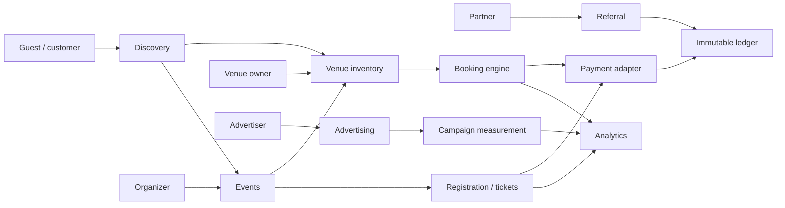

# 34 — Unified Experience, Events, Advertising and Monetization Addendum

**Status:** Product and architecture addendum for the current Spotva repository. This document extends the approved room-booking marketplace without replacing its working reservation, payment, ledger, brand, or partner-referral foundations.

## 34.1 Product Direction

Spotva should evolve from a room directory into a **real-world activity marketplace** with one connected loop:

> **Discover an activity → find a suitable space → reserve or register → attend → review and follow → return for the next session.**

The initial market remains Baku. The expanded supply includes meeting rooms, training rooms, classrooms, workshop spaces, event venues, podcast studios and photo/video studios. The expanded demand includes meetings, lessons, workshops, seminars, community gatherings, recordings, launches and corporate sessions.

This is not a reason to rebuild the existing booking core. The current `Provider → Location → Room → Availability → Booking → Payment → Ledger → Payout` path remains the transaction system of record. Events are an adjacent bounded context that can reserve a room through the same availability engine.

## 34.2 Design Integration Decision

The supplied visual concept contributed useful **layout ideas**: intent-first discovery, a broad search surface, category cards, an upcoming-activity rail, a partner area and explicit sponsor inventory. Its blue/coral palette is not adopted because the repository already contains an approved brand system.

The implementation therefore uses the repository’s canonical assets and tokens:

- **Primary:** Oil Green (`--color-primary`, approved palette)
- **CTA:** Amber (`--color-accent`, reserved for action)
- **Typography:** Fraunces for display and Golos Text for interface copy
- **Themes:** token-driven light, dark and system modes
- **Logo:** the existing SVG masters under `frontend/public/brand/`

No new visual palette or logo variant is introduced. Sponsor units use the same components as the rest of the product and are distinguished by a persistent **Sponsored** label, not by an unrelated ad-network look.

The photographic homepage cards added in this design pass are explicitly marked as preview content. They demonstrate the approved card system but must not be represented as real bookable businesses until verified provider records and provider-owned photography replace them. Asset provenance is recorded in `frontend/public/home/README.md`.

## 34.3 Bounded Contexts

| Context | Existing status | Additions |
|---|---|---|
| Venue inventory and booking | Implemented | Reused unchanged as the transactional core |
| Event publishing | New, staged | `OrganizerProfile`, `Event`, `EventSession`, `EventVenueLink` |
| Registration and ticketing | New, after discovery beta | `TicketType`, `Registration`, `Ticket`, `CheckIn` |
| Audience and community | New, later | organizer follow, series subscription, attendee messaging preferences |
| Partner referral | Implemented in `31_PARTNER_REFERRAL_ARCHITECTURE.md` | Reused for Mətbuat.az, Mentorix.io, Sayt.az and future partners |
| Advertising | New, staged | `AdCampaign`, `AdCreative`, `AdPlacement`, `AdImpression`, `AdClick` |

### Event-to-room relationship

An event may be attached to an existing Spotva room or to an external venue during the beta. When the organizer chooses a Spotva room, publishing a session creates a short-lived reservation hold and then a normal booking. The database exclusion constraint remains the authority for double-booking prevention. Event code must never maintain a second availability calendar.

## 34.4 Event Domain

| Entity | Core fields | Rule |
|---|---|---|
| `OrganizerProfile` | user, display name, biography, links, verification status | Separate from `Provider`; one person may be both |
| `Event` | organizer, title, description, category, language, status, visibility | Durable content object; may contain multiple sessions |
| `EventSession` | event, start/end, timezone, capacity, venue reference | All timestamps stored in UTC with source timezone |
| `EventVenueLink` | session, room booking or external address | Exactly one venue mode per session |
| `TicketType` | session, name, price, currency, allocation, sales window | `price = 0` represents free RSVP |
| `Registration` | attendee/contact, session, status, quantity, total | Separate from payment status, following booking/payment discipline |
| `Ticket` | registration, token, attendee name, status | One check-in identity per issued ticket |
| `CheckIn` | ticket, checked-in time, operator | Append-only event attendance record |

### Event state model

`DRAFT → PUBLISHED → SALES_OPEN → SOLD_OUT → COMPLETED`, with side paths to `CANCELLED` and `POSTPONED`. Payment remains separate: a registration can be `PENDING_PAYMENT` while its payment attempt fails and is retried.

## 34.5 Recommended Monetization

### Venue owners

| Revenue lever | Pilot recommendation | Rationale |
|---|---:|---|
| Listing | **0 AZN** | Removes the supply-side entry barrier |
| Successful booking commission | **8–15%**, default experiment at 10% | Spotva earns only when the venue earns; category/provider override already exists |
| Spotva Pro | **29–59 AZN/month** | Multi-location operations, staff roles, advanced analytics and calendar sync |
| Featured listing | **15–30 AZN/week** | Optional visibility; must not silently alter organic relevance |

The free tier remains deliberately generous on booking volume and intentionally limited on cost drivers such as photos, staff seats and analytics, consistent with `25_PROVIDER_ARCHITECTURE.md`.

### Organizers, educators and hosts

| Revenue lever | Pilot recommendation | Rationale |
|---|---:|---|
| Free event / RSVP | **0 AZN** | Builds inventory and community habit |
| Paid ticket service fee | **5% + payment processing** | Directly tied to organizer revenue |
| Organizer Pro | **29 AZN/month** | Series, CRM segments, exports and team roles |
| Event sponsorship | **150–500 AZN/campaign** | Adds organizer revenue and contextual sponsor value |

### Worked booking example

For a room with a **100 AZN** base price, a 10% venue commission, a 5% guest service fee and an illustrative 3% payment-processing fee:

| Line | Amount |
|---|---:|
| Room base price | 100.00 AZN |
| Guest service fee | +5.00 AZN |
| Customer pays | **105.00 AZN** |
| Venue commission | −10.00 AZN |
| Venue receivable | **90.00 AZN** |
| Spotva gross platform revenue | 15.00 AZN |
| Processing cost on 105 AZN | −3.15 AZN |
| Spotva net before tax and operations | **11.85 AZN** |

The guest service fee and venue commission must be separate ledger lines and separate checkout disclosures. Historical values are snapshotted at confirmation, so later rate changes never alter past transactions.

> These percentages are pilot hypotheses, not production tax advice. Commission, VAT treatment, invoice responsibility, payout timing and refund handling require Azerbaijan legal and accounting approval before real-money launch.

## 34.6 Advertising Inventory

| Placement | Pilot range | Measurement | Guardrail |
|---|---:|---|---|
| Sponsored listing | 15–30 AZN/week | impressions, listing opens, bookings | relevant category/availability only |
| Category sponsor | 150–300 AZN/week | banner impressions, CTA clicks, assisted bookings | one primary sponsor per category/page |
| Event sponsorship | 150–500 AZN/campaign | registrations, attendance, sponsor CTA | organizer approval required |
| Sponsored guide | 400–800 AZN/package | qualified reads, CTA clicks, leads | visually separate from editorial content |
| Referral partnership | 10–25% of Spotva’s platform fee | attributed confirmed bookings | never deducted from provider net |

### Advertising trust rules

1. Every paid placement is labeled **Sponsored** in every locale.
2. Paid placement does not change rating, review count or verification state.
3. Organic relevance and paid promotion are computed independently.
4. Impression and click events are first-party and server-verifiable where practical.
5. Frequency caps apply per session/user to avoid banner saturation.
6. Advertisers can target context (category, city, organizer type), not sensitive personal traits.
7. Sponsored content and partner relationships are visible in public disclosure pages.

## 34.7 Partner Placement Model

The partner hub is the permanent disclosure and discovery destination. Contextual modules then link back to it.

| Partner | Recommended role | Primary placements |
|---|---|---|
| [Mətbuat.az](https://metbuat.az/) | Media and special projects | sponsored editorial, event media-partner badge, campaign landing pages |
| [Mentorix.io](https://mentorix.io/) | Mentor and education ecosystem | organizer/mentor profiles, workshop series, referral landing pages |
| [Sayt.az](https://sayt.az/) | Web, hosting and technology | business-tools directory, provider onboarding package, referral offer |

The names above are implemented as **proposed ecosystem roles** unless a signed commercial agreement says otherwise. Public copy must not claim exclusivity, endorsement or formal partner status before approval.

Partner commission follows `31_PARTNER_REFERRAL_ARCHITECTURE.md`: it is paid from Spotva’s own platform fee, not from provider net and not as an extra customer charge. Last-click attribution, server-side click records and an httpOnly attribution cookie remain the V1 rules.

## 34.8 Public Information Architecture

The public navigation remains compact, but broadens from room-only language:

- **Spaces** → existing `/search`
- **Events** → `/events`
- **How it works** → existing education flow
- **For businesses** → providers and organizers
- Footer destinations: monetization, advertising and partner hub

New routes delivered in the current frontend pass:

- `/{locale}/events`
- `/{locale}/pricing`
- `/{locale}/partners`
- `/{locale}/advertise`

The event page explicitly describes the ticketing capability as staged beta; it does not fabricate live inventory before the event API exists.

## 34.9 Delivery Sequence

| Phase | Product outcome | Engineering scope |
|---|---|---|
| **Now** | Unified positioning, event-format discovery, pricing transparency, partner and ad pages | Frontend routes, i18n, responsive light/dark design; no fake transactional API |
| **E1** | Organizer profiles and free RSVP | event/session/registration schema, moderation, email reminders |
| **E2** | Paid tickets and QR check-in | payment adapter reuse, ticket issuance, refunds, scanner UI |
| **E3** | Series, follows and Organizer Pro | recurring sessions, audience permissions, exports and analytics |
| **A1** | Manual ad operations | admin-created campaigns, fixed placements, UTM reporting |
| **A2** | Self-service promotion | budget, inventory checks, approval workflow and billing |

## 34.10 Product Metrics

| Loop | Primary metric | Supporting metrics |
|---|---|---|
| Space marketplace | completed booking GMV | search-to-detail, detail-to-booking, utilization, repeat booking |
| Events | attended registrations | publish-to-registration, no-show rate, repeat attendees |
| Venue supply | active bookable inventory | onboarding completion, calendar freshness, host retention |
| Organizers | active organizer retention | events per organizer, paid conversion, repeat series |
| Advertising | incremental attributable value | qualified CTR, leads, assisted bookings, frequency |
| Partners | contribution margin after commission | clicks, confirmed bookings, refund-adjusted commission |

A partner or advertising campaign is successful only when it improves contribution margin or a clearly declared strategic metric; raw impression volume is not sufficient.
