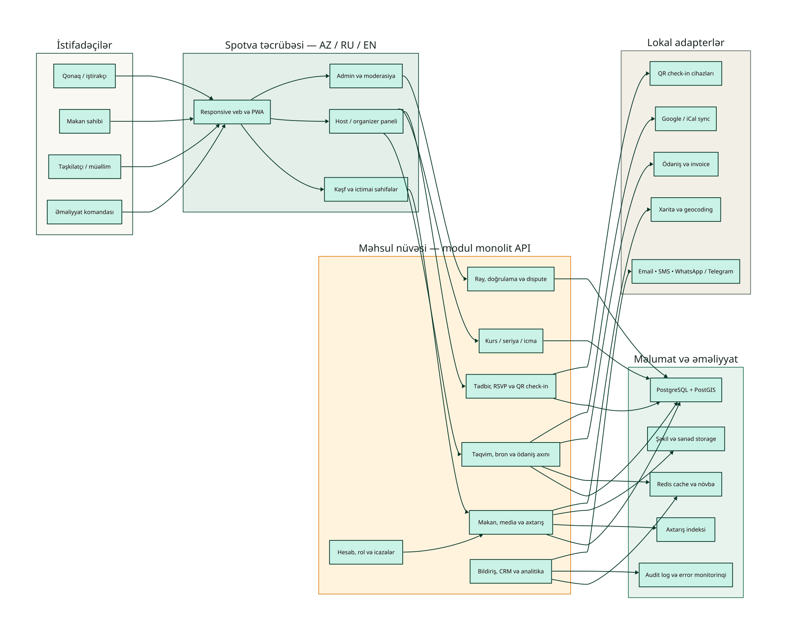

# Spotva: vahid məkan, tədbir və icma platforması üçün strategiya və dizayn analizi

> **Repository status note (2026-09-20):** This Azerbaijani document is preserved as a historical discovery input from the uploaded `Spotva.zip`. Its public-site availability and “logo not provided” observations describe the audit moment, not the current repository. The repository’s approved logo, Oil Green/Amber palette and design system in `SPOTVA_BRAND_IDENTITY_GUIDELINES_V1.md` and `08_DESIGN_SYSTEM.md` are authoritative. The blue/coral palette below is therefore not implemented. Current architecture and monetization decisions are consolidated in `34_UNIFIED_EXPERIENCE_EVENTS_ADS_MONETIZATION.md`.

**Hazırlayan:** Manus AI  
**Tarix:** 20 sentyabr 2026  
**Əhatə:** Spotva-nın açıq görünən vəziyyəti, Bakı üçün lokal-first məhsul strategiyası, light/dark dizayn istiqaməti, monetizasiya və qlobal miqyaslanma.

## Qısa nəticə

**Spotva-nı növbəti bilet kassası kimi yox, “harada, nə vaxt və kiminlə nəsə etmək olar?” sualını həll edən vahid yerli şəbəkə kimi qurmaq lazımdır.** Məhsulun birinci versiyası Bakıda məkan axtarışı, tədbir/RSVP, təlim-seriya və etibarlı təşkilatçı profillərini eyni məlumat modelində birləşdirməlidir. İstifadəçi bir fəaliyyət niyyəti ilə başlayır; Spotva ona uyğun məkan, yaxın tədbir, müəllim/host və qoşula biləcəyi icmanı göstərir.

İlkin strategiya **pulsuz siyahılama və pulsuz RSVP** olmalıdır. Əsas gəlir yalnız uğurlu bron, ödənişli qeydiyyat və ölçülən B2B dəyər yarandıqdan sonra gəlməlidir. Beləliklə, məkan sahibinin giriş baryeri azalır, sifarişçi isə bütün qiyməti, qaydaları və əlçatanlığı bir yerdə görür. Bu yanaşma həm təklif, həm də tələb tərəfini eyni vaxtda cəlb etmək üçün daha uyğundur.

## 1. Mövcud Spotva auditinin dəqiq sərhədi

20 sentyabr 2026 tarixində `spotva.co` HTTPS və HTTP üzərindən açılmadı; domen üçün A/AAAA cavabı əldə edilmədi. Brauzer `ERR_NAME_NOT_RESOLVED` qaytardı. Buna görə ana səhifənin faktiki dizaynı, loqosu, məzmun strukturu, mobil davranışı, performansı və mövcud funksiyalarını piksel və ya kod səviyyəsində qiymətləndirmək mümkün deyil. Domenin özü ilə açıq yoxlama bu nəticəni dəstəkləyir. [1]

Bu, təkcə texniki detal deyil. İctimai domen açılmırsa, brend axtarışda, sosial paylaşımlarda və birbaşa keçidlərdə etibar itirir; məhsulun ən vacib konversiyası baş vermir. İlk düzəliş canlı, HTTPS-li, indekslənə bilən və mobil-first giriş səhifəsidir.

| Yoxlanılan məsələ | Nəticə | Məhsul qərarına təsir |
| --- | --- | --- |
| Domenə giriş | `spotva.co` nəzərdən keçirmə vaxtında DNS-dən açılmadı | Canlı platformadan əvvəl DNS, TLS, yönləndirmə və uptime yoxlaması vacibdir |
| Mövcud loqo | Açıq saytda görünmədi; fayl verilmədi | Loqonu nə saxlamaq, nə dəyişmək barədə qəti qərar vermək olmaz |
| Mövcud rəng palitrası | Sayt görünmədiyi üçün texniki ekstraksiya mümkün deyil | Aşağıdakı palitra **təklifdir**, mövcud brenddən çıxarılmış rənglər deyil |
| Mövcud funksiyalar | UI və istifadəçi axınları yoxlanmadı | “Çatışmayan funksiyalar” bölməsi mövcud saytın deyil, planlanan məhsulun tələbləridir |

**Loqo qərarı:** Mövcud loqonu yalnız bu auditə əsasən dəyişmək olmaz. Default qərar onu saxlamaqdır. Onu SVG/PNG şəklində və ya işlək səhifədə gördükdən sonra dörd sınaq aparılmalıdır: 16–24 px-də oxunaqlılıq, birrəngli versiya, açıq/tünd fonda kontrast və fərqləndirici siluet. Bu sınaqlardan keçirsə, sadəcə tətbiq qaydaları hazırlanmalıdır; keçməzsə, yalnız işarə sadələşdirilməlidir, adın tanınması qorunmalıdır.

## 2. Bazarın verdiyi real imkan

Azərbaycanda [iTicket](https://iticket.az/) geniş tədbir kataloqu, kateqoriya/tarix/məkan filtrləri, mobil bilet və fiziki satış kanalları ilə görünən yerli oyunçudur. [3] [Azerbaijan Travel](https://azerbaijan.travel/new-event-calendar) bəzi tədbirlər üçün QR və fiziki bilet axınını göstərir. [4] [Birbilet](https://birbilet.az/en/) isə tədbir kəşfi ilə yanaşı, təşkilatçı üçün ayrıca tədbir yaratma keçidi və ödəmə tərəfdaşı göstərir. [5] Bu bazarda “sadəcə tədbir siyahısı” və ya “sadəcə bilet” ilə fərqlənmək çətin olacaq.

Məkan tərəfi daha parçalıdır. [Fikir Coworking](https://www.fikircoworking.com/) bəzi otaqlar üçün saatlıq qiymət və WhatsApp vasitəsilə sifariş göstərir. [6] [Fabrika Coworking](https://coworking.az/en/) məkan və görüş otağı üçün açıq qiymət göstərsə də, öz səhifəsində müvəqqəti bağlılıq da qeyd olunub. [7] Hotel tərəfdə tutum və xidmət məlumatı var, amma yekun qiymət çox vaxt sorğu ilə formalaşır; buna [Radisson Hotel Baku](https://www.radissonhotels.com/en-us/hotels/radisson-hotel-baku/meeting-events) və [Baku Marriott Hotel Boulevard](https://www.marriott.com/en-us/hotels/gydmb-baku-marriott-hotel-boulevard/events/) nümunədir. [8] [9]

> **Əsas boşluq:** Bakı üçün eyni səviyyədə strukturlaşdırılmış məkan məlumatı, real əlçatanlıq, tam qiymət, qayda, tədbir/təlim konteksti və etibarlı profil eyni yerdə deyil.

Spotva bu boşluğu “bütün inventarı kopyalamaqla” yox, **normalizə olunmuş məlumat və sürtünməsiz qərar** ilə bağlamalıdır. Hər məkan və tədbir üçün eyni sahələr göstərilməlidir: rayon və xəritə, tutumun düzülüşə görə növü, saatlıq/günlük yekun qiymət, minimum sifariş, avadanlıq, Wi‑Fi, səs limiti, depozit, vergi, ləğv qaydası, əlçatanlıq, son yenilənmə tarixi və sifariş statusu.

## 3. Məhsul mövqeləndirməsi

### Təklif olunan dəyər vədəsi

> **Spotva — Bakıda məkan tapmaq, tədbir yaratmaq, dərs və seminar keçmək, podkast yazmaq və yeni icmalara qoşulmaq üçün vahid platformadır.**

Bu vəd beş obyekti bir modelə bağlayır: **məkan**, **tədbir**, **kurs/seriya**, **müəllim/təşkilatçı** və **icma**. Eyni məkan bir workshop üçün bron edilə, həmin workshop Spotva-da tədbir kimi dərc oluna, müəllimin profilinə bağlana və sonradan təkrarlanan kurs seriyasına çevrilə bilməlidir. Bu əlaqə təkcə kataloqdan daha güclü şəbəkə effekti yaradır.

| İstifadəçi | Onun işi | Spotva-nın həlli | Niyə seçməlidir |
| --- | --- | --- | --- |
| İştirakçı | Bu həftə nə etmək və hara getmək | Şəhər, dil, büdcə, vaxt və marağa görə kəşf | Bir neçə dağınıq Instagram/WhatsApp/link əvəzinə etibarlı təqvim |
| Məkan sahibi | Boş saatları gəlirə çevirmək | Profil, təqvim, qiymət, sorğu/bron, analitika | Daha uyğun lead, daha az əl ilə yazışma, daha aydın təqdimat |
| Müəllim / təşkilatçı | Təlim və tədbiri doldurmaq | Tədbir səhifəsi, RSVP, seriya, QR check-in, xatırlatma | Sadə satış axını və öz auditoriyasını böyütmək |
| İcma lideri | Davamlı iştirakçı qrupunu idarə etmək | Qrup səhifəsi, moderator, təqvim, üzvlük və bildiriş | Təkrarlanan formatı birbaşa sosial şəbəkədən asılı etməmək |

## 4. İlk məhsul: hansı xüsusiyyətlər həqiqətən lazımdır

Məkan marketplace nümunəsi olan [Peerspace](https://www.peerspace.com/host) fəaliyyət növü, yer, tarix/saat və qonaq sayı ilə başlayan axtarış; hostun qiymət, təqvim və qayda idarəsi; platformadaxili yazışma və etibar qatını birləşdirir. [10] Tədbir tərəfində [Eventbrite](https://www.eventbrite.com/organizer/pricing/) daha dərin kəşf və əməliyyat imkanları təqdim edir; [Luma](https://luma.com/pricing) isə sürətli RSVP, waitlist, co-host və icma yönümlü yaratma axını ilə fərqlənir. [11] [12] Spotva-nın ilk versiyası bu iki yanaşmanın ən yüngül, lokal forması olmalıdır.

| Prioritet | Funksiya | İlk versiyada nə etməlidir | Niyə indi |
| --- | --- | --- | --- |
| P0 | İntent-first axtarış | “Nə edəcəyəm?”, rayon, vaxt, iştirakçı sayı və büdcə ilə nəticə verməlidir | İstifadəçi “otaq” yox, işini həll etmək istəyir |
| P0 | Məkan profili | Foto, tutum, qiymət, imkanlar, qayda, xəritə, son yenilənmə və doğrulama göstərməlidir | Qərar üçün əsas informasiya budur |
| P0 | Sorğu / bron | İki yol: “ani bron” və “host təsdiqi tələb olunur” | Hər məkan eyni əməliyyat modelinə hazır deyil |
| P0 | Tədbir və RSVP | Pulsuz/ödənişli qeydiyyat, limit, waitlist, bilet/RSVP statusu, iCal | Tədbir kəşfini real iştirakla bağlayır |
| P0 | Təkrarlanan seriya | Kurs, həftəlik dərs və podcast seriyası üçün sessiya səviyyəli dəyişiklik | Təlim və icma istifadəsi üçün vacibdir |
| P0 | Host / organizer paneli | Təqvim, qiymət, sorğular, iştirakçı siyahısı, əsas analitika | Təklif tərəfini əl işi yükdən çıxarır |
| P0 | Etibar və təhlükəsizlik | Telefon/e-poçt təsdiqi, manual listing yoxlaması, açıq qaydalar, şikayət/dispute | Marketplace-də etibar sonradan əlavə edilə bilməz |
| P1 | Ödəniş və depozit | Yerli ödəniş adapteri, invoice, refund və depozit qaydası | Yalnız pilot sorğu axını işləyəndən sonra |
| P1 | QR check-in | Mobil QR və ya manual iştirak qeydiyyatı | No-show ölçmək və tədbir keyfiyyətini görmək üçün |
| P1 | İzləmə / xatırlatma | Host, müəllim, məkan və kateqoriya follow; email/SMS/WhatsApp xatırlatması | Təkrar istifadəni artırır |
| P2 | Tövsiyə mühərriki | Baxış, RSVP, bron, saxlanılanlar və rayon siqnalları ilə | Aktivlik sıxlığı yaranandan sonra dəyərlidir |
| P2 | Partner API / widget | Saytda tədbir yerləşdirmə, təqvim sinxronu, white-label | B2B paylama fazası üçün |

[Meetup](https://help.meetup.com/hc/en-us/articles/39795590048781-Creating-a-repeating-event) təkrarlanan formatların idarə oluna bildiyini göstərir, lakin Spotva-da hər sessiya üçün məkan, müəllim, qiymət və proqram dəyişə bilməlidir. [13] Təhlükəsizlik üçün tədbir səhifəsində məsul əlaqə şəxsi, tutum, davranış kodeksi və şikayət kanalı olmalıdır. [Eventbrite-in trust & safety prinsipləri](https://www.eventbrite.com/blog/press/newsroom/eventbrites-trust-and-safety-values/) bu məsuliyyətin platforma, host və məkan arasında açıq paylaşılmasını vurğulayır. [14]

## 5. İstifadəçi axınları: vahid platformanın işləmə məntiqi

**İştirakçı axını** sadə olmalıdır: fəaliyyət niyyətini seçir → uyğun tədbir və ya məkan görür → qiymət və qaydaları müqayisə edir → RSVP edir və ya bron sorğusu göndərir → təqvimə əlavə edir → tədbirdən sonra rəy yazır və hostu izləyir.

**Məkan sahibi axını** onboarding ilə başlayır: sahiblik/idarəetmə hüququnu təsdiqləyir → yüksək keyfiyyətli foto və strukturlaşdırılmış məlumat əlavə edir → qiymət, əlavə xidmət və təqvim qurur → ani bronu və ya manual təsdiqi seçir → sorğunu cavablandırır → bron sonrası ödəniş və rəy alır.

**Müəllim/təşkilatçı axını** məkan seçimi ilə tədbir yaradılmasını eyni yerdə saxlayır: mövzu, dil, səviyyə, tutum, qiymət və seriya cədvəlini əlavə edir → məkanla əlaqələndirir → RSVP/bilet linkini paylaşır → check-in edir → növbəti sessiyanı və ya kursu eyni auditoriyaya təqdim edir.

Bu axınların ortaq elementləri istifadəçi hesabı, rol icazələri, status bildirişi və audit tarixçəsidir. Bu səbəbdən məhsulda üç ayrı sayt yox, bir məlumat modeli olmalıdır.

## 6. Dizayn konsepti: light və dark

Mövcud palitra çıxarıla bilmədiyi üçün aşağıdakı tokenlər **Spotva üçün tövsiyə olunan, müvəqqəti dizayn sistemidir**. Loqonun real rəngləri sonradan yoxlananda yalnız əsas vurğu rəngi uyğunlaşdırıla bilər. Məkan fotoşəkilləri və real istifadə məlumatları məhsulun emosional səviyyəsini formalaşdırmalıdır; dekorativ qradient və çox parlaq “event” estetikası əsas məzmunu kölgədə qoymamalıdır.

| Dizayn tokeni | Light | Dark | İstifadə |
| --- | --- | --- | --- |
| Brand / primary | `#3657E8` | `#4C6FFF` | Əsas CTA, aktiv tab, fokus halı |
| Warm accent | `#E55238` | `#FF7B5C` | Təcili CTA, seçilmiş tarix, vacib vurğu |
| Ink / canvas | `#151B26` | `#081523` | Light mətni, dark fonu |
| Surface | `#FFFFFF` | `#102238` | Kart və panel səthi |
| App background | `#F8F7F4` | `#0B1726` | Səhifə fonu |
| Subtle border | `#E5E8EE` | `#24384E` | Sərhəd və ayırıcı |
| Success / verified | `#1C7C54` | `#3FBE7E` | Doğrulama və mövcudluq statusu |
| Muted text | `#5D6878` | `#9FB0C4` | İkinci dərəcəli məlumat |

Light versiya ilk ziyarətçi üçün standart olmalıdır; açıq fon məkan fotoşəkillərinin və qiymət/availability məlumatının rahat oxunmasına kömək edir. Dark versiya isə gecə istifadəçiləri və tez-tez axtarış edən host/organizer üçün sistem üstünlüyü kimi saxlanmalıdır. Hər iki mod eyni komponent quruluşunu paylaşmalıdır: eyni filter, eyni kart, eyni status semantikası və eyni klaviatura fokus halı. Rəng təkbaşına məna verməməlidir; məsələn, “verified” həm yaşıl nişan, həm də mətn ilə görünməlidir.

> Light concept reference: supplied separately in the original audit package; its dashboard composition has been adapted to the current frontend.

*Light konsepti: vahid axtarış, məkan kartları, təqvim, icma profili və xəritə eyni kəşf səhnəsindədir. Yuxarıdakı dairəvi işarə loqo placeholderidir; mövcud Spotva loqosunun əvəzi deyil.*

> Dark concept reference: supplied separately in the original audit package; its information hierarchy has been adapted using the canonical Spotva theme tokens.

*Dark konsepti: eyni informasiya arxitekturası daha tünd iş səthində saxlanılır. Mockupdakı ingiliscə mətn və USD yalnız vizual nümunədir; məhsul AZ/RU/EN və AZN-first olmalıdır.*

### Tövsiyə olunan əsas ekran quruluşu

1. **Header:** Kəşf et, Məkanlar, Tədbirlər, Workshoplar, Podcastlar, İcmalar; axtarış, saxlanılanlar, hesab və dil seçimi.
2. **Hero search:** Fəaliyyət, rayon, tarix/saat, iştirakçı sayı və “Axtar” düyməsi. Bu, “mənə otaq lazımdır” dilini “10 nəfərlik workshop üçün sabah axşam məkan lazımdır” niyyətinə çevirir.
3. **Kontekst blokları:** “Bu həftəsonu”, “Bu gün boş olan məkanlar”, “Yaxınlığında workshoplar”, “Podcast üçün hazır studiyalar”.
4. **Kartlar:** Foto, istifadə tipi, rayon, tutum, saatlıq/dərs qiyməti, yekun qiymət izahı, verified statusu, vaxt və ləğv məlumatı. Kartdan birbaşa sorğu/RSVP mümkün olmalıdır.
5. **Etibar qatları:** Son yenilənmə tarixi, host cavab sürəti, doğrulama nəyin yoxlandığını izah edən tooltip, rəy qaydası və şikayət yolu.

## 7. Monetizasiya: hər iki tərəfin marağını necə qorumaq olar

Başlanğıcda Spotva üçün ən yaxşı model **“pulsuz daxil ol, uğurlu nəticədə ödə”** modelidir. Heç bir məkan sahibi boş təqvimini riskli platformaya görə əvvəlcədən ödəniş etməklə paylaşmaq istəmir. İştirakçı da tədbiri tapmaq və RSVP üçün tarif görmək istəmir.

| Faz | Məkan sahibi üçün stimul | İstifadəçi üçün stimul | Spotva gəliri |
| --- | --- | --- | --- |
| Pilot | Pulsuz onboarding, professional profil, foto standartı, ilk sorğular | Pulsuz kəşf/RSVP, açıq qiymət, real availability | Gəlir hədəfi deyil; likvidlik və keyfiyyət ölçülür |
| Etibarlı bron | Təqvim, lead idarəsi, host analitikası | Tam qiymət, təhlükəsiz ödəmə, aydın ləğv qaydası | Uğurlu bron və ya ödənişli qeydiyyatdan şəffaf xidmət haqqı |
| Pro alətlər | Komanda icazələri, təqvim sync, CRM, export, branded page | Daha tez cavab, daha çox verified seçim | İxtiyari SaaS / Pro abunə |
| Paylama | Widget, white-label, sponsorlu yer | Daha yaxşı kəşf və tərəfdaş üstünlükləri | Sponsorlu siyahı və B2B inteqrasiya |

Peerspace həm host, həm də qonaq tərəfində görünən xidmət haqqı ilə işləyir, amma onun ABŞ-a xas sığorta və zərər təminatı mexanizmlərini yerli bazara yoxlamadan köçürmək olmaz. [10] Spotva konkret komissiya faizini indi təyin etməməlidir. Əvvəl 20–30 kurasiya olunmuş məkan və 20–30 təşkilatçı ilə pilotda üç sual cavablandırılmalıdır: hansı kateqoriya ən tez dolur, sorğudan bronadək çevrilmə nədir və tərəflərin qəbul etdiyi xidmət haqqı nə qədərdir.

**Etibarlı monetizasiya prinsipi:** checkout-da “xidmət haqqı”, “ödəniş emalı”, “depozit”, “vergi” və “geri qaytarma” ayrı və aydın görünməlidir. Gizli əlavə xərc qısa müddətdə gəlir yaratsa da, marketplace etibarını dağıdar.

## 8. Texniki arxitektura və məlumat modeli

İlk mərhələdə mikroservis yox, **modul monolit** daha məntiqlidir. Məhsul sürətlə dəyişəcək, əməliyyat komandası isə kiçik olacaq. Modullar sərhədləri aydın saxlanılaraq bir tətbiqdə işləməlidir; aktivlik və ölkə sayı artdıqca bron/ödəniş, axtarış, bildiriş və media ayrıca xidmətlərə çıxarıla bilər.

*Arxitekturanın məğzi: bütün rollar bir responsive məhsulda işləyir; məkan, tədbir, kurs/seriya və etibar modulları eyni API və verilənlər modeli üzərindədir. Lokal ödəniş, təqvim, mesajlaşma, xəritə və QR ayrıca adapterlər kimi saxlanılır ki, ölkə və tərəfdaş dəyişəndə əsas məhsul nüvəsi yenidən yazılmasın.*

Əsas entitilər `User`, `Organization`, `Venue`, `Space`, `AvailabilityRule`, `ListingMedia`, `Event`, `Series`, `Session`, `BookingRequest`, `Booking`, `TicketOrRSVP`, `Payment`, `Payout`, `Review`, `Verification`, `Dispute` və `Notification` olmalıdır. `Event` həm ayrıca məkanda keçə, həm də `Series`-ə bağlı ola bilməlidir. `Venue` isə bir neçə `Space` saxlaya bilər. Bu əlaqə gələcəkdə workshop, seminar, podcast, foto/video çəkilişi və icma görüşü arasında ayrıca məhsullar yaratmadan genişlənməyə imkan verir.

Texniki minimum: responsive web/PWA, PostgreSQL + PostGIS ilə xəritə və məkan filtrləri, media üçün obyekt storage, axtarış indeksi, növbə/cache, audit log və xəta monitorinqi. Ödəniş, invoice, xəritə, təqvim, SMS/WhatsApp/Telegram və QR xidmətlərini adapter interfeysi ilə bağlamaq vacibdir. Beləliklə, Azərbaycan üçün seçilən provayder regional və ya qlobal mərhələdə əsas domen məntiqini dəyişmədən əvəz edilə bilər.

## 9. Miqyaslanma planı: Bakıdan qlobal platformaya

Qlobal genişlənməni “birdən çox ölkə” kimi yox, **təkrar edilə bilən şəhər launch playbook-u** kimi düşünmək lazımdır. Hər şəhərdə əvvəl keyfiyyətli təklif, sonra aktiv tələb; əvvəl əməliyyat keyfiyyəti, sonra marketinq xərci gəlməlidir.

| Mərhələ | Coğrafiya və fokus | Məhsul meyarı | Keçid siqnalı |
| --- | --- | --- | --- |
| 0–3 ay | Bakı; workshop, kiçik tədbir, coworking/meeting room, podcast studio | Kurasiya edilmiş kataloq, sorğu/RSVP, manual yoxlama | Listinglərdə tam məlumat, host cavab SLA-sı, ilk təkrar istifadə |
| 3–9 ay | Bakı; bron/ödəniş, kurs seriyası, QR check-in, CRM | Etibarlı checkout və host paneli | Sorğudan bronadək sabit çevrilmə, aşağı ləğv/dispute, təkrar bron |
| 9–18 ay | Gəncə, Sumqayıt, Şəki; sonra regional şəhərlər | Şəhər konfiqurasiyası, AZ/RU/EN, yerli tərəfdaş adapterləri | Hər yeni şəhərdə yetərli aktiv supply və işə yarayan əməliyyat playbook-u |
| 18+ ay | Seçilmiş regional/global şəhərlər | Çoxvalyuta, vergi/invoice, API/widget, daha güclü fraud və support | Şəhər üzrə müsbət unit economics və lokallaşdırılmış compliance |

İlk KPI-lar “app download” olmamalıdır. Daha vacib göstəricilər listing keyfiyyət balı, inventarın son yenilənmə yaşı, sorğuya cavab müddəti, sorğu→bron çevrilməsi, RSVP→check-in faizi, no-show, ləğv/dispute, təkrar bron və hostun aylıq aktivliyi olmalıdır. Bu göstəricilər yaxşı deyilsə, yeni şəhər və yeni kateqoriya əlavə etmək yalnız problemi böyüdəcək.

## 10. Növbəti 90 gün üçün icra planı

**İlk 30 gün** domeni, analytics-i, status səhifəsini və SEO əsaslarını bərpa etməyə həsr olunmalıdır. Paralel olaraq 15 məkan sahibi, 15 müəllim/təşkilatçı və 20 potensial iştirakçı ilə qısa müsahibə aparılmalıdır. Məqsəd “hansı funksiya lazımdır?” sualı yox, son həqiqi bron/RSVP prosesində harada vaxt və etibar itirdiklərini öyrənməkdir.

**31–60-cı günlərdə** 20–30 kurasiya olunmuş listing, 20–30 təşkilatçı profili və ən azı üç kateqoriya ilə private beta hazırlanmalıdır. Məkan məlumatı əl ilə yoxlanmalı, real qiymət və qayda sahələri məcburi edilməlidir. Sorğu/RSVP, təqvimə əlavə etmə, host cavab statusu və admin moderasiyası işləməlidir; platformadaxili ödəniş hələ məcburi olmaya bilər.

**61–90-cı günlərdə** ilk real bron/RSVP dövrü izlənməlidir. Ən çox sorğu alan kateqoriya, cavabsız lead, no-show, istifadəçi şikayəti və təkrar istifadə dəyərləndirildikdən sonra yalnız ən böyük darboğaz üçün ödəniş, depozit, QR, waitlist və ya CRM funksiyası əlavə olunmalıdır. Bu, böyük funksional siyahı yazmaqdan daha sürətli məhsul-bazar uyğunluğu yaradar.

## Son qərar

Spotva-nın doğru başlanğıcı **“Bakı üçün ən yaxşı tədbir saytı”** deyil. Doğru başlanğıc **“Bakı üçün etibarlı real-həyat infrastrukturu”** olmalıdır: məkanı tap, tədbiri yarat, dərs/seriyanı idarə et, insanları dəvət et və keyfiyyətli icma qur. Bilet satışını, kompleks seat map-i, öz reklam şəbəkəsini, ağır native tətbiqi və qlobal payout modelini başlanğıca yığmaq məhsulu ləngidər.

Mövcud loqo və rənglər görünmədiyi üçün bu sənəd onları dəyişmir. Təklif olunan dizayn sistemi, canlı brend materialı paylaşılanda onunla uyğunlaşdırılacaq qədər neytraldır. İndiki prioritetlər: **domenin bərpası, kurasiya olunmuş Bakı inventarı, düzgün məlumat modeli, pulsuz giriş, şəffaf qaydalar və ölçülən ilk bron/RSVP dövrü** olmalıdır.

## References

[1]: https://spotva.co "Spotva public domain"
[3]: https://iticket.az/ "iTicket.AZ event discovery and ticketing"
[4]: https://azerbaijan.travel/new-event-calendar "Azerbaijan Travel new event calendar"
[5]: https://birbilet.az/en/ "Birbilet event discovery and ticketing"
[6]: https://www.fikircoworking.com/ "Fikir Coworking"
[7]: https://coworking.az/en/ "Fabrika Coworking"
[8]: https://www.radissonhotels.com/en-us/hotels/radisson-hotel-baku/meeting-events "Radisson Hotel Baku meetings and events"
[9]: https://www.marriott.com/en-us/hotels/gydmb-baku-marriott-hotel-boulevard/events/ "Baku Marriott Hotel Boulevard events"
[10]: https://www.peerspace.com/host "Peerspace host marketplace"
[11]: https://www.eventbrite.com/organizer/pricing/ "Eventbrite organizer pricing and capabilities"
[12]: https://luma.com/pricing "Luma pricing and organizer capabilities"
[13]: https://help.meetup.com/hc/en-us/articles/39795590048781-Creating-a-repeating-event "Meetup repeating event guidance"
[14]: https://www.eventbrite.com/blog/press/newsroom/eventbrites-trust-and-safety-values/ "Eventbrite trust and safety values"
